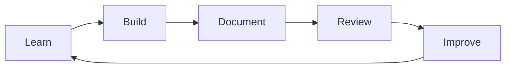

# Builder Method

## Mission

> Define the mission of this 90-Day AI Systems Builder Sprint.

- **Primary mission:**
- **Who this helps (me + future learners):**
- **Why now:**

## Educational Philosophy

- Learning by building real systems, not just consuming tutorials.
- Documenting decisions, trade-offs, and lessons as part of engineering practice.
- Converting learning artifacts into public portfolio evidence.

### Core Beliefs

- [ ] I learn fastest through project-based practice.
- [ ] Clarity of explanation is proof of understanding.
- [ ] Consistency beats intensity.
- [ ] Shipping small, complete increments compounds over time.

## Learning Principles

| Principle | What it means | How I will apply it |
|---|---|---|
| Build in public | Treat notes and repos as teaching assets | Write clear READMEs and weekly reviews |
| Deliberate practice | Focus on weaknesses intentionally | Schedule targeted drills each week |
| Feedback loops | Improve through review and iteration | Weekly retros + issue tracking |
| Systems thinking | Connect concepts across stack layers | Map inputs, outputs, tools, and evals |
| Portfolio-first execution | Every sprint output should be showcase-ready | Add demos, docs, and lessons learned |

## Definition of Mastery

Use this as the operating definition for “I know this topic.”

A topic is considered mastered when I can:

1. Explain it clearly in writing.
2. Implement it from scratch in a practical project.
3. Debug common failure modes.
4. Compare at least two implementation approaches.
5. Teach it with examples someone else can follow.

## The Builder Method Cycle

### Cycle Checklist

- [ ] Learn: studied core concept(s)
- [ ] Build: implemented concept in code
- [ ] Document: captured approach, assumptions, outcomes
- [ ] Review: evaluated results and gaps
- [ ] Improve: defined next iteration tasks

## Success Metrics

### Quantitative Metrics

| Metric | Target | Current | Notes |
|---|---:|---:|---|
| Focused hours/week | 10–15 | 0 | |
| GitHub commits/week | 10+ | 0 | |
| Projects shipped (90 days) | 3–5 | 0 | |
| Portfolio-ready case studies | 3+ | 0 | |
| Weekly reviews completed | 12/12 | 0 | |

### Qualitative Metrics

- Confidence explaining Python + Agentic AI architecture decisions.
- Ability to scope, build, and document end-to-end AI workflows.
- Improved engineering communication for collaborators and clients.

## Operating Rules

- [ ] Timebox learning; prioritize building output.
- [ ] Keep docs clear enough for external readers.
- [ ] Log blockers early and convert them into actionable tasks.
- [ ] End each week with evidence of progress.
- [ ] Maintain portfolio quality in every artifact.

## Revision Log

| Date | Version | What changed |
|---|---|---|
| YYYY-MM-DD | v0.1 | Initial template created |
